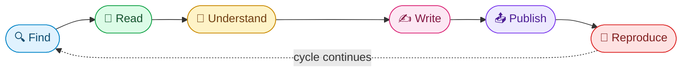

<h1 align="center">AI Papers Hub 🧠📚</h1>

  <em>Resources for finding, reading, and writing AI research papers.</em> 
  <em>Find · Read · Understand · Write · Publish · Reproduce</em>

  
  
  
  
  

  <b>🔗 300+ verified resources</b> · <b>📚 20 AI subfields</b> · <b>🆓 100% free</b> · <b>🔍 Auto-link-checked weekly</b>

  <b>Subfields covered:</b> LLMs · Agents · Interpretability · RAG · Vision · Generative AI · 3D & NeRF · RL · Robotics · Speech · Graph ML · Self-Supervised · Continual Learning · Distillation · Time Series · Federated · Theory · AI for Science · Ethics · Seminal Work

---

## 🚀 Quick Start

**I want to...**

| Goal | Jump to |
| --- | --- |
| 🔥 See today's trending AI papers | [Curated & Trending](#curated--trending) |
| 🎓 Start from scratch (I'm new to AI research) | [Foundational Reading](#13-foundational-reading) |
| 🎯 Find papers in a specific subfield | [By Subfield](#8-by-subfield-meta-directory) |
| ✍️ Write my first paper | [Write Papers](#4-write-papers) |
| 📤 Submit my paper to a venue | [Publish & Share](#5-publish--share-papers) |
| 🔁 Reproduce a result | [Reproduce & Implement](#6-reproduce--implement-papers) |
| 📰 Get a weekly digest | [Newsletters](#-newsletters) |
| 💻 Find free GPUs for experiments | [Free Compute](#free-compute) |

---

## 🔄 The Paper Lifecycle

The sections below follow the lifecycle of a paper. Use the table of contents to navigate.

---

## 📋 Table of Contents

1. [🔍 Find Papers](#1-find-papers)
2. [📖 Read Papers](#2-read-papers)
3. [🧠 Understand Papers](#3-understand-papers)
4. [✍️ Write Papers](#4-write-papers)
5. [📤 Publish & Share Papers](#5-publish--share-papers)
6. [🔁 Reproduce & Implement Papers](#6-reproduce--implement-papers)
7. [📰 Stay Updated](#7-stay-updated)
8. [🎯 By Subfield (meta-directory)](#8-by-subfield-meta-directory)
9. [🏢 Lab & Industry Research](#9-lab--industry-research)
10. [📊 Datasets, Benchmarks & Compute](#10-datasets-benchmarks--compute)
11. [💼 Career & Community](#11-career--community)
12. [🛠️ Tools & Utilities](#12-tools--utilities)
13. [📜 Foundational Reading](#13-foundational-reading)
14. [🙋 Contributing](#contributing)
15. [🙏 Acknowledgments](#acknowledgments)

---

## 1. Find Papers

### Preprint Servers
- **[arXiv](https://arxiv.org/)** — The canonical preprint server. Daily email digests available per category.
  - [cs.AI](https://arxiv.org/list/cs.AI/recent) · [cs.LG](https://arxiv.org/list/cs.LG/recent) · [cs.CL](https://arxiv.org/list/cs.CL/recent) · [cs.CV](https://arxiv.org/list/cs.CV/recent) · [cs.RO](https://arxiv.org/list/cs.RO/recent) · [cs.SD](https://arxiv.org/list/cs.SD/recent) · [stat.ML](https://arxiv.org/list/stat.ML/recent)
- **[bioRxiv](https://www.biorxiv.org/)** — Biology + computational biology + AI-for-science.
- **[medRxiv](https://www.medrxiv.org/)** — Medical AI preprints.
- **[OSF Preprints](https://osf.io/preprints/)** — Multi-discipline open science archive.
- **[HAL](https://hal.science/)** — French open archive, heavy CS coverage.
- **[SSRN](https://www.ssrn.com/)** — Crosses into economics, law, policy.

### Curated & Trending
> 💡 **Editor's starter pick:** Bookmark [Hugging Face Papers](https://huggingface.co/papers) and subscribe to one arXiv category email. That covers most people's daily needs.

- **[Hugging Face Papers](https://huggingface.co/papers)** — Daily trending arXiv papers with author engagement.
- **[alphaXiv](https://www.alphaxiv.org/)** — Open discussion forum that overlays arXiv (Stanford-built). Replace `arxiv.org` with `alphaxiv.org` in any paper URL.
- **[arxiv-sanity-lite](https://arxiv-sanity-lite.com/)** — Karpathy's personalized arXiv feed.
- **[Papers with Code Trending](https://paperswithcode.com/)** — Ranked by community attention, paired with code.
- **[Emergent Mind](https://www.emergentmind.com/)** — AI-curated digest of trending CS papers with social-media discussion aggregation.
- **[Scholar Inbox](https://www.scholar-inbox.com/)** — Free, personalized recommendations across arXiv, bioRxiv, etc. (University of Tübingen).
- **[AIModels.fyi](https://www.aimodels.fyi/)** — Plain-English summaries of trending papers and models.
- **[Cool Papers](https://papers.cool/)** — Fast arXiv browser with one-click Kimi/GPT Q&A per paper (Jianlin Su).

### Search Engines
- **[Google Scholar](https://scholar.google.com/)** — Broadest coverage; supports keyword and author alerts.
- **[Semantic Scholar](https://www.semanticscholar.org/)** — AI-powered, with TLDRs and citation graphs.
- **[Connected Papers](https://www.connectedpapers.com/)** — Visual graph of related work.
- **[ResearchRabbit](https://www.researchrabbit.ai/)** — "Spotify for papers"; visual citation discovery (free).
- **[Litmaps](https://www.litmaps.com/)** — Citation maps and discovery (free tier).
- **[CORE](https://core.ac.uk/)** — Aggregates open-access papers from thousands of repositories.
- **[BASE](https://www.base-search.net/)** — 300M+ open documents (Bielefeld).
- **[OpenAlex](https://openalex.org/)** — Free open catalog of global research.
- **[The Lens](https://www.lens.org/)** — Free scholarly + patent search over 250M+ works.
- **[DBLP](https://dblp.org/)** — CS bibliography for author/venue tracking.
- **[ResearchGate](https://www.researchgate.net/)** — Author-uploaded PDFs.

### Conference Proceedings & Reviews
- **[OpenReview](https://openreview.net/)** — Submissions + reviews for ICLR, NeurIPS, COLM, TMLR.
- **[NeurIPS Proceedings](https://papers.nips.cc/)**
- **[PMLR](https://proceedings.mlr.press/)** — ICML, AISTATS, COLT, UAI, CoRL, etc.
- **[ACL Anthology](https://aclanthology.org/)** — All NLP venues.
- **[CVF Open Access](https://openaccess.thecvf.com/)** — CVPR, ICCV, ECCV, WACV.
- **[AAAI Library](https://aaai.org/aaai-publications/aaai-conference-proceedings/)**
- **[IJCAI Proceedings](https://www.ijcai.org/proceedings/)**

### Open Access Journals
- **[JMLR](https://www.jmlr.org/)** — Journal of Machine Learning Research.
- **[TMLR](https://jmlr.org/tmlr/)** — Transactions on Machine Learning Research (rolling submissions).
- **[Distill](https://distill.pub/)** — Visual research articles (paused since 2021, archive remains online).

<a href="#-table-of-contents">⬆ Back to top</a>

---

## 2. Read Papers

### Reference Managers & Annotation
- **[Zotero](https://www.zotero.org/)** — Free, open-source reference manager.
- **[Mendeley](https://www.mendeley.com/)** — Reference manager + PDF reader.
- **[Hypothesis](https://web.hypothes.is/)** — Annotate any web page or PDF.

### AI-Powered Reading Assistants
- **[NotebookLM](https://notebooklm.google.com/)** — Upload papers, get summaries, Q&A, audio overviews.
- **[Elicit](https://elicit.com/)** — Research synthesis across many papers.
- **[Consensus](https://consensus.app/)** — AI search across research with claim-level evidence.
- **[Scite](https://scite.ai/)** — Shows whether citations support or contrast a claim.
- **[Explainpaper](https://www.explainpaper.com/)** — Highlight passages, ask questions.
- **[SciSpace](https://typeset.io/)** — AI-assisted reading (free tier).

### 📺 Video Paper Explanations
- **[Yannic Kilcher](https://www.youtube.com/@YannicKilcher)** — Deep dives on landmark papers.
- **[Two Minute Papers](https://www.youtube.com/@TwoMinutePapers)** — Quick visual summaries.
- **[AI Coffee Break with Letitia](https://www.youtube.com/@AICoffeeBreak)** — Accessible explanations.
- **[Andrej Karpathy](https://www.youtube.com/@AndrejKarpathy)** — Foundational walkthroughs (build LLM, GPT, tokenizer from scratch).
- **[3Blue1Brown](https://www.youtube.com/@3blue1brown)** — Math intuition behind ML.
- **[StatQuest with Josh Starmer](https://www.youtube.com/@statquest)** — Clear breakdowns of ML and stats fundamentals.
- **[Umar Jamil](https://www.youtube.com/@umarjamilai)** — Implements papers (Transformer, LLaMA, Flash Attention) from scratch in PyTorch.

### 🎙️ Paper Podcasts
- **[The Gradient Podcast](https://thegradientpub.substack.com/s/podcast)**
- **[Latent Space](https://www.latent.space/podcast)** — AI engineering + research.
- **[Machine Learning Street Talk](https://www.youtube.com/@MachineLearningStreetTalk)**
- **[TalkRL](https://www.talkrl.com/)** — Reinforcement learning focus.
- **[Dwarkesh Podcast](https://www.dwarkesh.com/)** — Long-form interviews with AI researchers and lab leaders.

<a href="#-table-of-contents">⬆ Back to top</a>

---

## 3. Understand Papers

### "How to Read a Paper" Guides
- [How to Read a Paper — S. Keshav (PDF)](https://web.stanford.edu/class/ee384m/Handouts/HowtoReadPaper.pdf) — The classic three-pass method.
- [Efficient Reading of Papers in Science and Technology (PDF)](https://www.cs.columbia.edu/~hgs/netbib/efficientReading.pdf)

### Math & Notation References
- **[The Matrix Cookbook (PDF)](https://www.math.uwaterloo.ca/~hwolkowi/matrixcookbook.pdf)** — Reference for matrix identities and derivatives.
- **[Matrix Calculus for Deep Learning](https://arxiv.org/abs/1802.01528)** — Parr & Howard.
- **[Mathematics for Machine Learning](https://mml-book.github.io/)** — Free book, Deisenroth et al.
- **[Probabilistic Machine Learning](https://probml.github.io/pml-book/)** — Kevin Murphy, free.
- **[Deep Learning Book](https://www.deeplearningbook.org/)** — Goodfellow, Bengio, Courville.
- **[Pattern Recognition and Machine Learning](https://www.microsoft.com/en-us/research/uploads/prod/2006/01/Bishop-Pattern-Recognition-and-Machine-Learning-2006.pdf)** — Bishop; free PDF since 2016.
- **[The Elements of Statistical Learning](https://hastie.su.domains/ElemStatLearn/)** — Hastie, Tibshirani, Friedman; free PDF.
- **[An Introduction to Statistical Learning (ISL)](https://www.statlearning.com/)** — James, Witten, Hastie, Tibshirani; free PDF with Python and R editions.
- **[Neural Networks and Deep Learning](http://neuralnetworksanddeeplearning.com/)** — Michael Nielsen's free online book; the gentlest rigorous intro.
- **[Reinforcement Learning: An Introduction](http://incompleteideas.net/book/the-book-2nd.html)** — Sutton & Barto, 2nd edition; the canonical RL textbook.
- **[Dive into Deep Learning](https://d2l.ai/)** — Free interactive book with runnable code (Zhang et al.).
- **[Understanding Deep Learning](https://udlbook.github.io/udlbook/)** — Simon Prince; free modern textbook with notebooks and slides.
- **[The Little Book of Deep Learning](https://fleuret.org/francois/lbdl.html)** — François Fleuret; free phone-sized primer.

### Visual & Interactive Explainers
- **[Distill.pub](https://distill.pub/)** — Visual research articles.
- **[The Illustrated Transformer](https://jalammar.github.io/illustrated-transformer/)** — Jay Alammar.
- **[The Annotated Transformer](http://nlp.seas.harvard.edu/annotated-transformer/)** — Harvard NLP's line-by-line code walkthrough of the original paper.
- **[The Annotated Diffusion Model](https://huggingface.co/blog/annotated-diffusion)** — Hugging Face's DDPM-in-PyTorch walkthrough.
- **[Lil'Log](https://lilianweng.github.io/)** — Lilian Weng's deep technical posts.
- **[Sebastian Raschka's blog](https://sebastianraschka.com/blog/)**
- **[Chris Olah's blog](https://colah.github.io/)** — Foundational visual intuition.
- **[Andrej Karpathy's blog](https://karpathy.github.io/)** — Older deep-learning posts; still widely referenced.
- **[Transformer Circuits Thread](https://transformer-circuits.pub/)** — Anthropic's interpretability research.
- **[Transformer Explainer](https://poloclub.github.io/transformer-explainer/)** — Interactive GPT-2 running live in the browser (Georgia Tech).
- **[LLM Visualization](https://bbycroft.net/llm)** — Brendan Bycroft's 3D walkthrough of GPT inference, layer by layer.

### Free Courses Tied to Papers
- **[Stanford CS231n](http://cs231n.stanford.edu/)** — Vision.
- **[Stanford CS224n](https://web.stanford.edu/class/cs224n/)** — NLP.
- **[Stanford CS336](https://stanford-cs336.github.io/)** — Building LLMs from scratch.
- **[Hugging Face Courses](https://huggingface.co/learn)** — NLP, RL, audio, diffusion.
- **[fast.ai](https://www.fast.ai/)** — Practical deep learning.
- **[Spinning Up in Deep RL](https://spinningup.openai.com/)** — OpenAI.
- **[Neural Networks: Zero to Hero](https://karpathy.ai/zero-to-hero.html)** — Karpathy's build-from-scratch series (micrograd, GPT, tokenizer).
- **[MIT 6.S191](http://introtodeeplearning.com/)** — Intro to Deep Learning; refreshed yearly.
- **[Stanford CS25: Transformers United](https://web.stanford.edu/class/cs25/)** — Guest-lecture seminar; talks posted free on YouTube.
- **[DeepLearning.AI Specializations](https://www.deeplearning.ai/courses/)** — Andrew Ng's course catalog (audit free).

<a href="#-table-of-contents">⬆ Back to top</a>

---

## 4. Write Papers

### LaTeX Tools & Templates
- **[Overleaf](https://www.overleaf.com/)** — Online LaTeX editor (free tier).
- **[Detexify](https://detexify.kirelabs.org/)** — Draw a symbol, get the LaTeX command.
- **[arXiv style templates](https://github.com/kourgeorge/arxiv-style)**
- **[Mathpix](https://mathpix.com/)** — OCR math from images to LaTeX (free tier).

### Writing Guides
- **[How to Write a Great Research Paper](https://www.microsoft.com/en-us/research/academic-program/write-great-research-paper/)** — Simon Peyton Jones.
- **[The Elements of Style](https://www.bartleby.com/141/)** — Strunk & White (free online).

### Figures & Diagrams
- **[Excalidraw](https://excalidraw.com/)** — Hand-drawn-style diagrams.
- **[draw.io / diagrams.net](https://www.drawio.com/)** — General-purpose diagramming.
- **[Inkscape](https://inkscape.org/)** — Open-source vector graphics.
- **[TikZ examples](https://texample.net/tikz/)** — LaTeX-native diagrams.
- **[Matplotlib gallery](https://matplotlib.org/stable/gallery/)** — Plotting reference.

### Citation Tools
- **[Zotero](https://www.zotero.org/)** — BibTeX export + browser plugin.
- **[BibTeX from DOI](https://www.doi2bib.org/)** — Quick BibTeX lookups.
- **[ORCID](https://orcid.org/)** — Persistent author identifier.

<a href="#-table-of-contents">⬆ Back to top</a>

---

## 5. Publish & Share Papers

### Where to Submit
- **[arXiv submission guide](https://info.arxiv.org/help/submit/index.html)** — Endorsement and rules.
- **[OpenReview](https://openreview.net/)** — Hosts most ML conference submissions.
- **[ICML](https://icml.cc/) · [NeurIPS](https://neurips.cc/) · [ICLR](https://iclr.cc/)** — Top general ML.
- **[TMLR](https://jmlr.org/tmlr/)** — Rolling-submission ML journal.
- **[ACL Rolling Review](https://aclrollingreview.org/)** — Continuous NLP review.

### Conference Deadlines
- **[AI Deadlines (Hugging Face)](https://huggingface.co/spaces/huggingface/ai-deadlines)** — Maintained successor to the old `aideadlin.es`; tracks top AI conference deadlines with countdowns.
- **[WikiCFP](http://www.wikicfp.com/cfp/)** — Broader CFP aggregator.

### Peer Review
- **[How to Write a Good Review (NeurIPS)](https://neuripsconf.medium.com/tips-for-reviewers-37bd55c1fe0d)**

### Open Access & Preprint Policy
- **[SHERPA/RoMEO](https://v2.sherpa.ac.uk/romeo/)** — Journal self-archiving policies.
- **[DOAJ](https://doaj.org/)** — Directory of Open Access Journals.
- **[Unpaywall](https://unpaywall.org/)** — Browser extension; finds free legal PDFs.
- **[Open Access Button](https://openaccessbutton.org/)** — Similar, legal.

<a href="#-table-of-contents">⬆ Back to top</a>

---

## 6. Reproduce & Implement Papers

### Papers ↔ Code
- **[Papers with Code](https://paperswithcode.com/)** — Implementations + benchmark leaderboards.
- **[Hugging Face Models](https://huggingface.co/models)** — Often the fastest path to weights.
- **[Hugging Face Datasets](https://huggingface.co/datasets)**
- **[GitHub Trending](https://github.com/trending)** — Where research code lives.
- **[Replicate](https://replicate.com/)** — Run and fine-tune published models in the cloud with one line of code.

### Reproducibility
- **[ML Reproducibility Challenge](https://reproml.org/)** — Annual replication effort; an official NeurIPS 2026 track.
- **[ML Code Completeness Checklist](https://github.com/paperswithcode/releasing-research-code)**
- **[ReScience C](https://rescience.github.io/)** — Peer-reviewed replication journal for computational science.
- **[Weights & Biases](https://wandb.ai/)** — Experiment tracking (free tier).
- **[MLflow](https://mlflow.org/)** — Open-source experiment tracking.
- **[DVC](https://dvc.org/)** — Git-style version control for datasets and ML pipelines.
- **[CodaLab Worksheets](https://worksheets.codalab.org/)** — Reproducible computational research platform.

<a href="#-table-of-contents">⬆ Back to top</a>

---

## 7. Stay Updated

### 📰 Newsletters
- **[The Batch](https://www.deeplearning.ai/the-batch/)** — Andrew Ng, weekly.
- **[Import AI](https://importai.substack.com/)** — Jack Clark, weekly.
- **[AlphaSignal](https://alphasignal.ai/)** — Daily technical digest.
- **[TLDR AI](https://tldr.tech/ai)** — Daily 5-minute AI brief.
- **[Smol AI / AI News](https://news.smol.ai/)** — Daily aggregator of AI Twitter, Discords, and Reddit (Swyx).
- **[The Sequence](https://thesequence.substack.com/)** — Research deep dives.
- **[Last Week in AI](https://lastweekin.ai/)** — Newsletter + podcast.
- **[Ahead of AI](https://magazine.sebastianraschka.com/)** — Sebastian Raschka.
- **[Interconnects](https://www.interconnects.ai/)** — Nathan Lambert on RLHF, frontier models.
- **[AI as Normal Technology](https://www.normaltech.ai/)** — Arvind Narayanan & Sayash Kapoor (formerly the AI Snake Oil blog).

### 💬 Communities
- **[r/MachineLearning](https://www.reddit.com/r/MachineLearning/)**
- **[Hugging Face Discord](https://huggingface.co/join/discord)**
- **[EleutherAI Discord](https://www.eleuther.ai/)**
- **[ML Collective](https://mlcollective.org/)**
- **[Hacker News](https://news.ycombinator.com/)** — Major papers usually surface.

<a href="#-table-of-contents">⬆ Back to top</a>

---

## 8. By Subfield (meta-directory)

Each subfield below links to maintained **awesome lists** that cover the area in more depth. Please star them too.

**Quick jump:** [LLMs](#-large-language-models) · [Agents](#-ai-agents--autonomous-systems) · [Interpretability](#-mechanistic-interpretability--alignment) · [RAG](#-retrieval-augmented-generation-rag) · [Vision](#-computer-vision) · [Generative](#-generative-ai-diffusion--multimodal) · [3D & NeRF](#-3d-nerf--gaussian-splatting) · [RL](#-reinforcement-learning) · [Robotics](#-robotics--embodied-ai) · [Speech](#-speech--audio) · [Graphs](#-graph-ml) · [Self-Supervised](#-self-supervised--representation-learning) · [Continual](#-continual--lifelong-learning) · [Distillation](#-knowledge-distillation--compression) · [Time Series](#-time-series) · [Federated](#-federated--distributed-learning) · [Theory](#-theory--statistics) · [Science](#-ai-for-science) · [Ethics](#-ai-ethics-fairness--policy) · [Seminal](#-best-papers--seminal-work)

### 🗣️ Large Language Models
- [Awesome-LLM](https://github.com/Hannibal046/Awesome-LLM) — The canonical LLM resource list.
- [Awesome-Efficient-LLM](https://github.com/horseee/Awesome-Efficient-LLM) — Inference and training efficiency.
- [Awesome-LLM-Inference](https://github.com/xlite-dev/Awesome-LLM-Inference) — Flash-Attention, Paged-Attention, quantization.
- [Awesome-LLM-Safety](https://github.com/ydyjya/Awesome-LLM-Safety) — Safety research for LLMs.
- [Awesome-LLM-Reasoning](https://github.com/atfortes/Awesome-LLM-Reasoning) — Chain-of-thought, tree-of-thought, self-consistency, o1/R1-style reasoning.
- [Awesome-LLM-Long-Context-Modeling](https://github.com/Xnhyacinth/Awesome-LLM-Long-Context-Modeling) — Long-context attention and memory architectures.
- [Awesome-Mixture-of-Experts](https://github.com/XueFuzhao/awesome-mixture-of-experts) — MoE architectures (Switch, GShard, Mixtral, DeepSeek-MoE).
- [Awesome-Prompt-Engineering](https://github.com/promptslab/Awesome-Prompt-Engineering) — Prompting techniques and surveys.
- [Awesome-Code-LLM](https://github.com/huybery/Awesome-Code-LLM) — Code generation models, benchmarks, and surveys.
- arXiv: [cs.CL](https://arxiv.org/list/cs.CL/recent) · venue: [ACL Anthology](https://aclanthology.org/)

### 🤖 AI Agents & Autonomous Systems
- [Awesome AI Agent Papers (VoltAgent)](https://github.com/VoltAgent/awesome-ai-agent-papers) — Updated weekly from arXiv.
- [Awesome Papers Autonomous Agent](https://github.com/lafmdp/Awesome-Papers-Autonomous-Agent) — RL-based + LLM-based agents.
- [Awesome Multi-Agent Papers](https://github.com/kyegomez/awesome-multi-agent-papers)
- [Awesome Agent Papers (luo-junyu)](https://github.com/luo-junyu/Awesome-Agent-Papers)

### 🔬 Mechanistic Interpretability & Alignment
- [Awesome Mechanistic Interpretability](https://github.com/gauravfs-14/awesome-mechanistic-interpretability) — Auto-updates from arXiv.
- [Awesome LLM Interpretability](https://github.com/JShollaj/awesome-llm-interpretability)
- [Awesome Interpretability in LLMs (ruizheliUOA)](https://github.com/ruizheliUOA/Awesome-Interpretability-in-Large-Language-Models)
- [Apart Research Mechanistic Interpretability](https://github.com/apartresearch/mechanisticinterpretability)
- [Alignment Forum](https://www.alignmentforum.org/) — Discussion + posts.
- [Transformer Circuits Thread](https://transformer-circuits.pub/) — Anthropic's interpretability work.

### 🔍 Retrieval-Augmented Generation (RAG)
- [Awesome-LLM-RAG](https://github.com/jxzhangjhu/Awesome-LLM-RAG)
- [Awesome-RAG (Danielskry)](https://github.com/Danielskry/Awesome-RAG) — Resource map: tools, frameworks, papers.
- [RAG-Survey (hymie122)](https://github.com/hymie122/RAG-Survey) — RAG for AIGC.
- [Awesome-RAG-Reasoning](https://github.com/DavidZWZ/Awesome-RAG-Reasoning) — RAG + reasoning.

### 👁️ Computer Vision
- [Awesome Computer Vision](https://github.com/jbhuang0604/awesome-computer-vision) — The canonical list.
- [Awesome Detection Transformer](https://github.com/IDEA-Research/awesome-detection-transformer)
- [Awesome Visual Transformer](https://github.com/dk-liang/Awesome-Visual-Transformer)
- arXiv: [cs.CV](https://arxiv.org/list/cs.CV/recent) · venue: [CVF Open Access](https://openaccess.thecvf.com/)

### 🎨 Generative AI, Diffusion & Multimodal
- [Awesome Generative AI](https://github.com/steven2358/awesome-generative-ai)
- [Awesome Diffusion Models](https://github.com/diff-usion/Awesome-Diffusion-Models)
- [Awesome Vision-Language Models](https://github.com/jingyi0000/VLM_survey) — VLM survey + paper list.
- [Awesome Multimodal LLMs](https://github.com/BradyFU/Awesome-Multimodal-Large-Language-Models) — Survey-grade MLLM list with regular updates.
- [Awesome LMMs Mechanistic Interpretability](https://github.com/itsqyh/Awesome-LMMs-Mechanistic-Interpretability) — Multimodal interpretability.

### 🧊 3D, NeRF & Gaussian Splatting
- [Awesome NeRF](https://github.com/awesome-NeRF/awesome-NeRF) — Neural radiance fields and follow-ups.
- [Awesome 3D Gaussian Splatting](https://github.com/MrNeRF/awesome-3D-gaussian-splatting) — The fast-moving 3DGS literature.
- [Awesome 3D Generation](https://github.com/justimyhxu/awesome-3D-generation) — Text-to-3D and image-to-3D.

### 🎮 Reinforcement Learning
- [Awesome RL](https://github.com/aikorea/awesome-rl) — Canonical RL list.
- [Spinning Up in Deep RL](https://spinningup.openai.com/) — Tutorial + curated papers (OpenAI).
- [RLJ](https://rlj.cs.umass.edu/) — Reinforcement Learning Journal.

### 🦾 Robotics & Embodied AI
- [Awesome Robotics](https://github.com/kiloreux/awesome-robotics)
- [Awesome Embodied AI](https://github.com/haoranD/Awesome-Embodied-AI)
- arXiv: [cs.RO](https://arxiv.org/list/cs.RO/recent) · venue: [CoRL](https://www.corl.org/)

### 🎙️ Speech & Audio
- [Awesome Speech Recognition & Synthesis Papers](https://github.com/zzw922cn/awesome-speech-recognition-speech-synthesis-papers) — ASR, TTS, voice conversion, music.
- arXiv: [cs.SD](https://arxiv.org/list/cs.SD/recent) · venue: [ISCA Archive](https://www.isca-archive.org/) (Interspeech)

### 🕸️ Graph ML
- [Awesome Graph Neural Networks (thunlp)](https://github.com/thunlp/GNNPapers)

### 🔄 Self-Supervised & Representation Learning
- [Awesome Self-Supervised Learning](https://github.com/jason718/awesome-self-supervised-learning) — Canonical list.
- [Awesome Contrastive Self-Supervised Learning](https://github.com/asheeshcric/awesome-contrastive-self-supervised-learning)

### ♻️ Continual & Lifelong Learning
- [Awesome Incremental Learning / Lifelong Learning](https://github.com/xialeiliu/Awesome-Incremental-Learning) — Canonical list; class-incremental, task-incremental.

### 🧠 Knowledge Distillation & Compression
- [Awesome Knowledge Distillation](https://github.com/dkozlov/awesome-knowledge-distillation) — KD papers, surveys, code.
- [Awesome Model Quantization](https://github.com/Efficient-ML/Awesome-Model-Quantization) — Post-training and quantization-aware training.

### ⏳ Time Series
- [Awesome AI for Time Series Papers](https://github.com/qingsongedu/awesome-AI-for-time-series-papers) — Forecasting, anomaly detection, foundation models.
- [Time-Series-Library](https://github.com/thuml/Time-Series-Library) — Implementations of leading models (Tsinghua).

### 🤝 Federated & Distributed Learning
- [Awesome Federated Learning (chaoyanghe)](https://github.com/chaoyanghe/Awesome-Federated-Learning)
- [Awesome Federated Machine Learning](https://github.com/innovation-cat/Awesome-Federated-Machine-Learning) — Frameworks, papers, datasets.

### 📐 Theory & Statistics
- [JMLR](https://www.jmlr.org/) · [COLT proceedings](https://proceedings.mlr.press/)
- arXiv: [stat.ML](https://arxiv.org/list/stat.ML/recent)

### 🧪 AI for Science
- [Awesome AI for Science](https://github.com/ai-boost/awesome-ai-for-science) — Physics, chemistry, biology, materials.
- arXiv: [physics.comp-ph](https://arxiv.org/list/physics.comp-ph/recent), [q-bio](https://arxiv.org/list/q-bio/recent)

### ⚖️ AI Ethics, Fairness & Policy
- [FAccT proceedings](https://facctconference.org/)
- [AIES proceedings](https://www.aies-conference.com/)
- [Stanford HAI](https://hai.stanford.edu/research)

### 🏆 Best Papers & Seminal Work
- [Awesome AI Best Papers (shunk031)](https://github.com/shunk031/awesome-ai-best-papers) — Best Paper Awards since 1996 (ACL, AAAI, CVPR, EMNLP, ICCV, ICLR, ICML, NAACL).
- [Awesome AI Research Papers (awesomelistsio)](https://github.com/awesomelistsio/awesome-ai-research-papers) — Seminal/foundational papers.
- [Awesome AI Papers (aimerou)](https://github.com/aimerou/awesome-ai-papers) — Impactful papers by date.

<a href="#-table-of-contents">⬆ Back to top</a>

---

## 9. Lab & Industry Research

<b>📓 Major Lab Blogs</b> — click to expand

- [Google Research](https://research.google/blog/) · [Google DeepMind](https://deepmind.google/discover/blog/)
- [OpenAI](https://openai.com/research)
- [Anthropic](https://www.anthropic.com/research)
- [Meta AI / FAIR](https://ai.meta.com/research/)
- [Microsoft Research](https://www.microsoft.com/en-us/research/blog/)
- [Apple Machine Learning Research](https://machinelearning.apple.com/)
- [NVIDIA Research](https://research.nvidia.com/)
- [Hugging Face Blog](https://huggingface.co/blog) — Frequent technical write-ups.
- [Mistral AI](https://mistral.ai/news/)
- [xAI](https://x.ai/news)
- [Salesforce AI Research](https://www.salesforceairesearch.com/)
- [IBM Research AI](https://research.ibm.com/artificial-intelligence)
- [Alibaba DAMO Academy](https://damo.alibaba.com/labs/language-technology)
- [Cohere Research](https://cohere.com/research)
- [BAIR (Berkeley)](https://bair.berkeley.edu/blog/)
- [Stanford AI Lab](https://ai.stanford.edu/blog/)
- [CMU ML Blog](https://blog.ml.cmu.edu/)
- [MIT CSAIL](https://www.csail.mit.edu/news)
- [Allen Institute for AI (AI2)](https://allenai.org/blog)

### 📈 Annual State-of-AI Reports
- **[Stanford AI Index](https://aiindex.stanford.edu/report/)** — Annual report on AI trends, models, and policy.
- **[State of AI Report](https://www.stateof.ai/)** — Nathan Benaich.
- **[Epoch AI](https://epochai.org/)** — Trends in compute, models, data.

<a href="#-table-of-contents">⬆ Back to top</a>

---

## 10. Datasets, Benchmarks & Compute

### Dataset Hubs
- **[Hugging Face Datasets](https://huggingface.co/datasets)**
- **[Papers with Code Datasets](https://paperswithcode.com/datasets)**
- **[Kaggle Datasets](https://www.kaggle.com/datasets)**
- **[Google Dataset Search](https://datasetsearch.research.google.com/)**
- **[Common Crawl](https://commoncrawl.org/)** — Web-scale corpus underlying most LLM pretraining.
- **[FineWeb](https://huggingface.co/datasets/HuggingFaceFW/fineweb)** — 15T-token cleaned web dataset (Hugging Face).
- **[RedPajama](https://www.together.ai/blog/redpajama)** — Open reproduction of LLaMA's training mix.
- **[The Pile](https://pile.eleuther.ai/)** — 825 GB diverse corpus (EleutherAI); foundational open dataset.

### Benchmarks & Leaderboards
- **[Papers with Code SOTA](https://paperswithcode.com/sota)**
- **[Open LLM Leaderboard](https://huggingface.co/spaces/open-llm-leaderboard/open_llm_leaderboard)**
- **[Chatbot Arena (LMArena)](https://lmarena.ai/)**
- **[BIG-bench](https://github.com/google/BIG-bench)**
- **[HELM](https://crfm.stanford.edu/helm/)** — Stanford's Holistic Evaluation of Language Models.
- **[SWE-bench](https://www.swebench.com/)** — Real-world software engineering tasks for LLMs.
- **[MMLU-Pro](https://huggingface.co/datasets/TIGER-Lab/MMLU-Pro)** — Harder, less-saturated successor to MMLU.
- **[GPQA](https://github.com/idavidrein/gpqa)** — Graduate-level, Google-proof Q&A benchmark.
- **[LiveBench](https://livebench.ai/)** — Contamination-free, monthly-refreshed leaderboard.
- **[MTEB](https://huggingface.co/spaces/mteb/leaderboard)** — Massive Text Embedding Benchmark; 50+ tasks, 100+ languages.
- **[BFCL](https://gorilla.cs.berkeley.edu/leaderboard.html)** — Berkeley Function Calling Leaderboard; tool-use evaluation.
- **[GAIA](https://huggingface.co/spaces/gaia-benchmark/leaderboard)** — General AI Assistants benchmark; multi-step real-world tasks.
- **[τ-bench](https://github.com/sierra-research/tau-bench)** — Sierra's tool-agent-user interaction benchmark.
- **[Aider Polyglot](https://aider.chat/docs/leaderboards/)** — Code-editing leaderboard across multiple languages.
- **[ARC-AGI](https://arcprize.org/leaderboard)** — Abstraction and reasoning corpus; François Chollet.
- **[Humanity's Last Exam](https://lastexam.ai/)** — 2,500 frontier expert questions across 100+ subjects (CAIS + Scale).
- **[Artificial Analysis](https://artificialanalysis.ai/)** — Independent model comparison across quality, speed, and price.

### Free Compute
- **[Google Colab](https://colab.research.google.com/)** — Free GPU tier.
- **[Kaggle Notebooks](https://www.kaggle.com/code)** — Free GPU/TPU hours (30 hrs/week GPU).
- **[Hugging Face Spaces](https://huggingface.co/spaces)** — Free CPU; paid GPU.
- **[Lightning Studios](https://lightning.ai/)** — Free tier.
- **[Modal](https://modal.com/)** — Serverless GPU; monthly free credits.
- **[Paperspace](https://www.paperspace.com/artificial-intelligence)** — Free GPU notebook tier (M4000).
- **[TPU Research Cloud](https://sites.research.google/trc/)** — Free Cloud TPU access for accepted research projects.

<a href="#-table-of-contents">⬆ Back to top</a>

---

## 11. Career & Community

### Internships & Residencies
- [Google Research Careers](https://research.google/careers/)
- [Google DeepMind Careers](https://deepmind.google/about/careers/)
- [Meta AI Residency](https://ai.meta.com/join-us/residency-program/)
- [OpenAI Residency](https://openai.com/residency)
- [Anthropic Careers](https://www.anthropic.com/careers)
- [NVIDIA Graduate Fellowships](https://research.nvidia.com/graduate-fellowships)
- [Microsoft Research Academic Program](https://www.microsoft.com/en-us/research/academic-program/)

### Open Research Communities
- **[ML Collective](https://mlcollective.org/)**
- **[Cohere For AI](https://cohere.com/research)** — Open research community.
- **[EleutherAI](https://www.eleuther.ai/)**
- **[LAION](https://laion.ai/)** — Open large-scale multimodal datasets.
- **[FAR.AI](https://far.ai/)** — AI safety research org with open collaborations.

<a href="#-table-of-contents">⬆ Back to top</a>

---

## 12. Tools & Utilities

### Browser Extensions
- **[Unpaywall](https://unpaywall.org/products/extension)** — Finds free legal PDFs.
- **[Zotero Connector](https://www.zotero.org/download/connectors)** — Save citations from any page.
- **[Open Access Button](https://openaccessbutton.org/)** — Similar to Unpaywall, legal.
- **[CatalyzeX](https://www.catalyzex.com/)** — Surfaces code implementations for papers on Google, arXiv, Twitter.

### Accessibility
- **[arXiv HTML versions](https://info.arxiv.org/about/accessibility_html_papers.html)** — Better for screen readers.
- **[ar5iv](https://ar5iv.labs.arxiv.org/)** — Higher-fidelity HTML rendering of arXiv papers.
- **[DeepL](https://www.deepl.com/)** — High-quality translation (free tier).

### Open APIs
- **[arXiv API](https://info.arxiv.org/help/api/)** — Programmatic search and metadata.
- **[Semantic Scholar API](https://www.semanticscholar.org/product/api)** — Citations, embeddings, TLDRs (free).
- **[OpenAlex API](https://docs.openalex.org/)** — 200M+ scholarly works; open data, no API key needed.
- **[Hugging Face Hub API](https://huggingface.co/docs/hub/api)** — Programmatic model/dataset access.
- **[Crossref REST API](https://api.crossref.org/swagger-ui/index.html)** — DOI metadata for 150M+ records.

<a href="#-table-of-contents">⬆ Back to top</a>

---

## 13. Foundational Reading

Papers cited throughout AI research. Useful as background reading.

<b>🏗️ Deep Learning Foundations</b>

- **[ImageNet Classification with Deep CNNs (AlexNet)](https://papers.nips.cc/paper/2012/hash/c399862d3b9d6b76c8436e924a68c45b-Abstract.html)** — Krizhevsky et al., 2012.
- **[Dropout](https://jmlr.org/papers/v15/srivastava14a.html)** — Srivastava et al., 2014.
- **[Adam optimizer](https://arxiv.org/abs/1412.6980)** — Kingma & Ba, 2014.
- **[Batch Normalization](https://arxiv.org/abs/1502.03167)** — Ioffe & Szegedy, 2015.
- **[Deep Residual Learning (ResNet)](https://arxiv.org/abs/1512.03385)** — He et al., 2015.
- **[U-Net](https://arxiv.org/abs/1505.04597)** — Ronneberger et al., 2015; backbone for segmentation and diffusion.

<b>🗣️ Transformers & LLMs</b>

- **[Word2Vec](https://arxiv.org/abs/1301.3781)** — Mikolov et al., 2013.
- **[Seq2Seq](https://arxiv.org/abs/1409.3215)** — Sutskever et al., 2014.
- **[Attention (Bahdanau)](https://arxiv.org/abs/1409.0473)** — Bahdanau, Cho, Bengio, 2014.
- **[Attention Is All You Need](https://arxiv.org/abs/1706.03762)** — Vaswani et al., 2017.
- **[BERT](https://arxiv.org/abs/1810.04805)** — Devlin et al., 2018.
- **[Sparsely-Gated MoE](https://arxiv.org/abs/1701.06538)** — Shazeer et al., 2017; foundation of modern MoE models.
- **[GPT-3](https://arxiv.org/abs/2005.14165)** — Brown et al., 2020.
- **[Scaling Laws (Kaplan)](https://arxiv.org/abs/2001.08361)** — Kaplan et al., 2020.
- **[Chain-of-Thought Prompting](https://arxiv.org/abs/2201.11903)** — Wei et al., 2022.
- **[Chinchilla scaling laws](https://arxiv.org/abs/2203.15556)** — Hoffmann et al., 2022.
- **[FlashAttention](https://arxiv.org/abs/2205.14135)** — Dao et al., 2022; IO-aware exact attention.
- **[LoRA](https://arxiv.org/abs/2106.09685)** — Hu et al., 2021; low-rank adapters; ubiquitous for fine-tuning.
- **[LLaMA](https://arxiv.org/abs/2302.13971)** — Touvron et al., 2023; catalyst for open-weights LLMs.
- **[Mamba](https://arxiv.org/abs/2312.00752)** — Gu & Dao, 2023; selective state space models.

<b>🎮 Reinforcement Learning</b>

- **[DQN — Playing Atari](https://arxiv.org/abs/1312.5602)** — Mnih et al., 2013.
- **[A3C](https://arxiv.org/abs/1602.01783)** — Mnih et al., 2016; asynchronous actor-critic.
- **[AlphaGo](https://www.nature.com/articles/nature16961)** — Silver et al., 2016.
- **[PPO](https://arxiv.org/abs/1707.06347)** — Schulman et al., 2017.
- **[AlphaZero](https://arxiv.org/abs/1712.01815)** — Silver et al., 2017; self-play across Go/chess/shogi.
- **[MuZero](https://arxiv.org/abs/1911.08265)** — Schrittwieser et al., 2019; planning with a learned model.

<b>🎨 Generative Models & Vision</b>

- **[VAE](https://arxiv.org/abs/1312.6114)** — Kingma & Welling, 2013.
- **[GANs](https://arxiv.org/abs/1406.2661)** — Goodfellow et al., 2014.
- **[Denoising Diffusion Probabilistic Models](https://arxiv.org/abs/2006.11239)** — Ho et al., 2020.
- **[Vision Transformer (ViT)](https://arxiv.org/abs/2010.11929)** — Dosovitskiy et al., 2020.
- **[NeRF](https://arxiv.org/abs/2003.08934)** — Mildenhall et al., 2020; neural radiance fields.
- **[CLIP](https://arxiv.org/abs/2103.00020)** — Radford et al., 2021; learning visual concepts from text.
- **[Masked Autoencoders (MAE)](https://arxiv.org/abs/2111.06377)** — He et al., 2021.
- **[Latent Diffusion / Stable Diffusion](https://arxiv.org/abs/2112.10752)** — Rombach et al., 2022.
- **[3D Gaussian Splatting](https://arxiv.org/abs/2308.04079)** — Kerbl et al., 2023; real-time radiance fields.

<b>🛡️ Alignment & Safety</b>

- **[Concrete Problems in AI Safety](https://arxiv.org/abs/1606.06565)** — Amodei et al., 2016.
- **[Deep RL from Human Preferences](https://arxiv.org/abs/1706.03741)** — Christiano et al., 2017; the RLHF lineage.
- **[InstructGPT / RLHF](https://arxiv.org/abs/2203.02155)** — Ouyang et al., 2022.
- **[Constitutional AI](https://arxiv.org/abs/2212.08073)** — Bai et al., 2022.
- **[Direct Preference Optimization (DPO)](https://arxiv.org/abs/2305.18290)** — Rafailov et al., 2023.

<b>🧪 AI for Science (Foundational)</b>

- **[AlphaFold 2](https://www.nature.com/articles/s41586-021-03819-2)** — Jumper et al., 2021; protein structure prediction.
- **[Graph Networks as Learnable Physics Engines](https://arxiv.org/abs/1806.01242)** — Sanchez-Gonzalez et al., 2018.
- **[GNoME — Materials Discovery](https://www.nature.com/articles/s41586-023-06735-9)** — Merchant et al., 2023.

<a href="#-table-of-contents">⬆ Back to top</a>

---

## Contributing

Pull requests welcome! See [`CONTRIBUTING.md`](CONTRIBUTING.md) for full guidelines.

**Quick rules:**

1. The resource must be **free** or have a meaningful free tier.
2. **Verify the link works** before submitting (our weekly link-check workflow will also catch it).
3. Add to the most appropriate section, following the existing format.
4. One sentence description max.
5. No shadow libraries, no ad-heavy aggregators, no paywall-only sites.

**First time contributing?** [GitHub's guide to first contributions](https://github.com/firstcontributions/first-contributions) walks you through every step.

## Acknowledgments

This list points at work done by others. Thanks to:

- **The `awesome` movement** — started by [Sindre Sorhus](https://github.com/sindresorhus/awesome), which created the format and culture that makes lists like this possible.
- **The maintainers of every subfield list** linked in [Section 8](#8-by-subfield-meta-directory). They do the curation work — this hub is mostly a pointer to their efforts. Please ⭐ their repos.
- **arXiv, Hugging Face, Papers with Code, OpenReview, Semantic Scholar, the Allen Institute for AI**, and every other open-access platform that makes AI research freely available.
- **The personal-blog writers** — Lilian Weng, Chris Olah, Jay Alammar, Sebastian Raschka, Andrej Karpathy, and many more — whose explainers help thousands of people understand papers they otherwise couldn't.
- **Everyone who has ever submitted a PR to an awesome list.** This whole ecosystem only works because people give their time away for free.

If you maintain a resource linked here and want the description changed or removed, open an issue — we'll fix it immediately.

## License

Released under [CC0 1.0](https://creativecommons.org/publicdomain/zero/1.0/) — public domain. Use however you want, no attribution required.

---

  ⭐ <b>Star this repo</b> if it helped you, and share it with someone getting into AI research. 
  🐛 <b>Found a broken link or have a suggestion?</b> <a href="https://github.com/vishwadg/ai-papers-hub/issues/new">Open an issue</a>.

